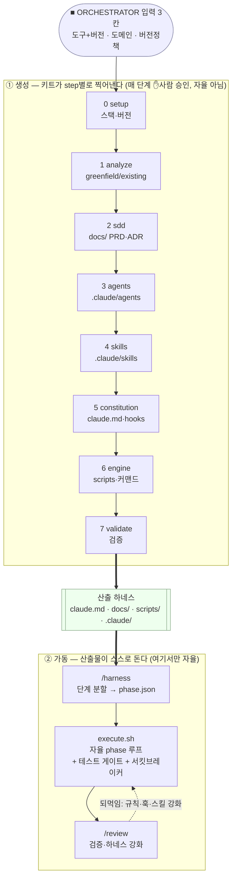

# Harness Engineering Kit — 하네스를 만드는 하네스

빈/기존 프로젝트에 **자율 개발 하네스**를 step별로 찍어내는 키트. Claude Code에 붙여넣으면
도구·도메인에 맞는 에이전트·스킬을 풍부하게 생성하고, SDD 문서 두뇌 + 자율 실행 엔진 +
가드레일을 갖춘 하네스를 구축한다. — **"하네스를 만드는 하네스".**

## 핵심 한 줄
- **키트 = 생성기.** `steps/0→7`을 **사람 승인 받으며 step별로** 진행해 하네스를 찍어낸다(자율 아님).
- **산출물 = 자율 하네스.** 생성된 `scripts/execute.sh`가 `/harness`로 쪼갠 단계를 **스스로 실행**한다.
- 도구+도메인에 맞춰 에이전트·스킬을 **많이** 만들되, 작업 시엔 **필요한 것만 활성화**된다.

## 1층 vs 2층 하네스
- **1층(내장)**: Claude Code 기본 안전장치(메인 force-push 금지 등).
- **2층(이 키트)**: 프로젝트 전용 — 확정 스키마 보호, API 래퍼 강제, 고유 패턴 준수, TDD·서킷브레이커.
  경량 커스텀으로 복잡성을 낮추면서 컨텍스트에 밀착된 제어력을 확보한다.

## 파일 종류 (사람은 입력만 채운다)
| 종류 | 위치 | Claude가 | 사람이 |
|------|------|----------|--------|
| **지침** | `steps/N_*.md` | 읽는다 | 안 건드림 |
| **지식** | `kb/*.md` | 참조한다 | 안 건드림 |
| **블루프린트** | `catalog/{index.yaml,agents/*,skills/*}` | 골라 구체화 | 안 건드림 |
| **골격** | `templates/**/*.tmpl` | 떠서 구축 | 안 건드림 |
| **입력** | `ORCHESTRATOR.md`의 ■ 칸 3개 | 읽고 실행 | **채운다 (여기뿐)** |

## 디렉터리
```
harness-engineering-kit/
├── README.md                  ← 지금 이 파일 (전체 지도)
├── ORCHESTRATOR.md            ← 붙여넣는 진입 프롬프트 (입력 칸 3개)
│
├── steps/                     ← 생성 흐름 (step별 진행, 매 단계 승인)
│   └── 0_setup · 1_analyze · 2_sdd · 3_agents · 4_skills · 5_constitution · 6_engine · 7_validate
│
├── kb/                        ← 지식베이스 (설계원칙·안전규칙·도구매핑·에이전트/스킬 가이드·진화·메트릭)
│
├── catalog/                   ← 도구→블루프린트 (풍부한 라이브러리)
│   ├── index.yaml             도구/키워드 → 선택 규칙
│   ├── agents/                backend/frontend/infra/k8s/db-migration/ci-cd/reviewer/security/qa
│   └── skills/                add-rest-endpoint·write-integration-test·fix-bug-with-test·refactor·
│                              add-db-migration·add-frontend-component·add-terraform-module·
│                              add-k8s-manifest·add-helm-chart·add-alert-rule·add-ci-workflow·cross-boundary-check
│
├── templates/                 ← 산출물 골격
│   ├── claude.md.tmpl · AGENT · SKILL · settings.json · architecture · result-report · instincts
│   ├── sdd/                   prd(+MVP제외)·architecture·adr·ui-guide
│   ├── engine/                execute.sh·phase.json·harness.md·review.md
│   ├── hooks/                 safety·tdd-gate·circuit-breaker·observe
│   └── reports/               version-table·discovery·architecture-design·validation
│
├── examples/sample-harness/   ← 완성 산출물 예시 (픽스처)
└── tools/                     ← token-report.sh · check-sample.sh
```

## 산출물 — 내 프로젝트에 무엇이 생기나
키트(읽기 전용)를 step 0~7로 돌리면 **대상 프로젝트**에 아래가 안착한다.
```
<내 프로젝트>/
├── claude.md                  ← 헌법(단일 소스, # CRITICAL: Safety·TDD). 상시 로드.
├── harness.md                 ← /harness: 문서 분석 → 단계 분할 → phase.json
├── review.md                  ← /review: 검증 + 하네스 강화
├── docs/                      ← SDD 두뇌
│   ├── prd.md (+## MVP 제외) · architecture.md · adr/ · ui-guide.md
│   ├── work_orders/           (사용자 입력) · result_report/ (작업 이력)
├── scripts/
│   ├── execute.sh             ← 자율 phase 엔진 (bash+jq)
│   └── phase.json             ← 진행/상태 (execute.sh만 작성)
└── .claude/
    ├── agents/*.md            ← catalog에서 선택 (상황별)
    ├── skills/*/SKILL.md      ← catalog에서 선택 (description 트리거)
    ├── hooks/{safety,tdd-gate,circuit-breaker,observe}.sh
    ├── settings.json          ← 훅 등록
    └── instincts/<hash>/      ← 진화 관찰 로그 + 승격 후보
```
> 옛 `.claude/rules/safety.md`는 폐지 — 안전 정책은 `claude.md`(# CRITICAL), 강제는 훅.

## 흐름 두 단계



- **①은 사람 게이트**(버전표·분석·PRD/SDD·에이전트·스킬·가동준비), **②만 자율**.
- 자율은 `execute.sh` 내부 루프만 소유 — **✋사람 승인(approved) + 서킷브레이커 + phase별 타임아웃 +
  블랙리스트/TDD 훅**의 4중 방어로 경계.

## 가드레일 (시스템으로 강제, 말이 아님)
- **safety.sh** — `rm -rf`·force-push·`git reset --hard`·apply/destroy·migrate·시크릿 차단(exit 2).
- **tdd-gate.sh** — 실패 테스트 없는 구현 파일 작성 차단(exit 2). 단계마다 테스트.
- **circuit-breaker.sh** — 연속 N회 실패 시 자율 루프 정지(exit 2).
- **observe.sh** — 비차단 관찰(exit 0) → 진화 루프(`kb/evolution.md`).

## 사용법 (사람)
1. 이 키트 폴더를 프로젝트 어딘가에 둔다. 위치를 `ORCHESTRATOR.md`의 `<키트 경로>`에 적는다.
2. 이 README로 흐름을 파악한다.
3. `ORCHESTRATOR.md`의 **■ 입력 칸 3개**만 채운다(도구+버전 / 도메인 / 버전정책).
4. 채운 프롬프트를 Claude Code에 붙여넣는다 → **step 0부터 단계별 진행, 매 step 승인.**
5. 산출물 가동: `/harness`로 단계 분할·승인 → `bash scripts/execute.sh` → `/review`.
6. 막히면 해당 `steps/N_*.md`를 직접 연다.

## 측정
- `tools/token-report.sh` — 빌드/런타임 토큰·중복·게이트(`--gate <proj>` 위반 시 non-zero). 규칙 `kb/metrics.md`.
- `tools/check-sample.sh` — `examples/sample-harness` 픽스처 점검(구조·훅 문법/JSON·엔진·sdd 존재). 샘플 수정 시 통과 필수.
- 훅·엔진은 `jq` 필요. 타임아웃은 `gtimeout`(coreutils) 있으면 사용, 없으면 순수 bash 워치독 fallback.

## 설계 사상
- **말로 지시 말고 시스템으로 강제** — 권한차단 → Hook → CI → 텍스트(`kb/design-principles.md`).
- **사양 밀도가 런타임 안정성** — PRD의 `## MVP 제외`·ADR의 why/트레이드오프가 자율 실행의 품질을 가른다.
- **취향은 코드 말고 하네스에** — 마음에 안 드는 패턴은 `claude.md`·훅·스킬을 깎아 고친다(`/review`).
- **완벽 설계 대신 반복 개선** — `kb/evolution.md`의 관찰→축적→승격→정리.
