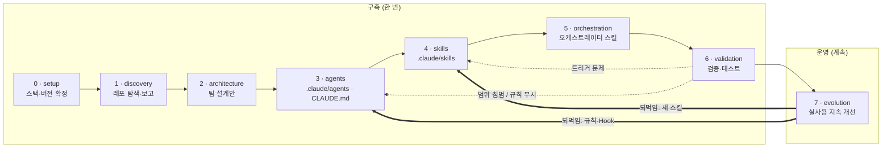

# Dev/Infra Harness Kit — Phase별 구조

revfactory/harness의 메타 스킬(원본 6-Phase)을 **개발(앱)+인프라(DevOps)** 도메인으로
재구성하고, 실사용 피드백 단계(Phase 7)를 더해 **7-Phase**로 확장한 키트.
Claude Code에 붙여넣으면 프로젝트에 에이전트·스킬·오케스트레이터(`.claude/`)를
단계별로 구축한다. — **"하네스를 만드는 하네스".**

## 핵심 한 줄
- Phase 0~6 = 하네스를 **구축**한다.
- Phase 7 = 실사용 패턴을 앞 단계로 **되먹여** 진화시킨다.
- 각 Phase 끝마다 **멈추고 사람 승인**을 받는다 (Human-in-the-loop).

## 파일은 세 종류뿐

| 종류 | 위치 | Claude가 | 사람이 |
|------|------|----------|--------|
| **지침·지식** | `phase/phaseN_*/README.md` + `*.md` | **읽는다** | 안 건드림 |
| **골격(template)** | `templates/*.tmpl` | **떠서 구축한다** | 안 건드림 |
| **입력** | `ORCHESTRATOR.md`의 ■ 칸 3개 | 읽고 실행한다 | **채운다 (여기뿐)** |

> 결과물(`CLAUDE.md`, `.claude/agents`, `.claude/skills`)은 **프로젝트의 `.claude/`** 에 생성된다.
> 키트 파일 자체는 산출물이 아니다.

## 디렉터리 = 실행 순서

```
phased-agent-harness-setting/
├── README.md                      ← 지금 이 파일 (전체 지도)
├── ORCHESTRATOR.md                ← Claude Code에 붙여넣는 진입 프롬프트 (입력 칸 3개)
│
├── phase/                         ← 7단계 (번호 = 실행 순서)
│   ├── phase0_setup/              스택·버전 확정
│   │   ├── README.md
│   │   ├── version-policy.md      버전 미기재 시 검색·선정 규칙
│   │   └── tooling-matrix.md      도구 → 검증 명령 매핑 (뒤 Phase도 계속 참조)
│   ├── phase1_discovery/          레포 탐색·보고만 (파일 생성 금지)
│   │   ├── README.md
│   │   └── discovery-checklist.md 탐색 6항목
│   ├── phase2_architecture/       팀 설계 (실행모드·6패턴·분리축)
│   │   ├── README.md
│   │   └── agent-design-patterns.md
│   ├── phase3_agents/             .claude/agents/*.md + 루트 CLAUDE.md 생성
│   │   ├── README.md
│   │   ├── team-examples.md       실전 팀 3종
│   │   └── qa-agent-guide.md      경계면 교차비교 + 7개 버그 패턴
│   ├── phase4_skills/             .claude/skills/*/SKILL.md 생성
│   │   ├── README.md
│   │   └── skill-writing-guide.md pushy description · Progressive Disclosure
│   ├── phase5_orchestration/      오케스트레이터 스킬 생성
│   │   ├── README.md
│   │   └── orchestrator-template.md
│   ├── phase6_validation/         트리거·범위·with/without 검증
│   │   ├── README.md
│   │   └── skill-testing-guide.md
│   └── phase7_evolution/          실사용 지속 개선 (관찰→점수→승격→정리)
│       ├── README.md
│       ├── evolution-guide.md
│       ├── observe-spec.md        관찰 Hook 명세 + observe.sh
│       └── instinct-format.md     저장 포맷 + 신뢰도 점수
│
├── templates/                     ← 산출물 골격 (Phase 3·4·5가 떠서 씀)
│   ├── README.md
│   ├── CLAUDE.md.tmpl             → 프로젝트 루트 CLAUDE.md (60줄 이하)
│   ├── AGENT.md.tmpl              → .claude/agents/{name}.md
│   └── SKILL.md.tmpl             → .claude/skills/{name}/SKILL.md
│
└── _shared/                       ← 여러 Phase 공통
    ├── README.md
    ├── design-principles.md       횡단 원칙 (시스템강제·도구최소·컨텍스트상한·Bug Log)
    ├── safety-rules.md            위험명령 차단 + Hook 강제
    ├── result-report.md           단계 종료 시 짧은 작업 리포트 규칙
    ├── architecture-doc.md        전체 구조 스냅샷 유지 + 토큰 절약 갱신 규칙
    └── work-orders.md             작업참고서·작업지시서(docs/work_orders/) 참조 규칙
```

## 적용 결과 — 내 프로젝트에 무엇이 생기나

이 키트(읽기 전용 재료)를 Phase 0~7로 돌리면, **대상 프로젝트**에 아래가 순차로 안착한다.
키트 폴더 자체는 산출물이 아니다 — 결과는 전부 프로젝트의 `.claude/`와 `docs/`에 떨어진다.

```
<내 프로젝트>/
├── CLAUDE.md                       ← Phase 3: 진입 맵 + 상시 규칙 (60줄, 항상 로드)
│                                     (Map / Build&Test / Conventions / Docs&WorkOrders / NEVER / Bug Log)
├── .claude/
│   ├── agents/                     ← Phase 3: 에이전트 정의 (backend-dev, infra-dev, reviewer, qa…)
│   │   └── {name}.md
│   ├── skills/                     ← Phase 4·5: 스킬 + 오케스트레이터
│   │   ├── {skill}/SKILL.md
│   │   └── {orchestrator}/SKILL.md
│   ├── settings.json               ← Phase 3(안전 Hook) · Phase 7(관찰 Hook) 등록
│   ├── hooks/                      ← Phase 3: safety.sh  /  Phase 7: observe.sh
│   └── instincts/<project-hash>/   ← Phase 7: 관찰 로그 + 승격 후보 (raw/observations.log, instincts.md)
└── docs/
    ├── architecture.md             ← Phase 5 생성 · 이후 구조 변경 시 부분 갱신 (스냅샷 1개)
    ├── result_report/              ← 매 작업·단계 종료 시 새 파일 (이력)
    │   └── YYYYMMDD_HHMMSS.md
    └── work_orders/                ← 사용자가 작업지시서를 넣는 곳 (키트는 읽기만)
        └── <작업지시서>.md
```

> `_workspace/`(에이전트 간 중간 산출물)는 작업 중 임시로 쓰고 감사용으로 보존한다.

## 흐름 한눈에 (실행 순서)

번호 순서대로 진행한다. **0~6은 하네스를 구축하는 일회성 단계, 7은 가동 후 계속 도는
실사용 단계**다. 매 단계 끝에 멈추고 사람 승인을 받는다.



- **0 → 6**: 한 번 구축하는 단계. 2(설계)가 끝나야 3~6(실제 파일 구축)이 시작된다.
- **6 → 되돌아가기**(점선): 검증서 문제가 나오면 원인 단계로 복귀 후 재검증.
- **7 → 되먹임**(굵은 선): 실사용 패턴을 규칙·스킬·Hook으로 승격해 Phase 3·4에 반영.

## 사용법 (사람)

1. 이 키트 폴더를 적용할 프로젝트 안(예: `<프로젝트>/harness-template/`)에 둔다.
2. 이 README로 전체 흐름을 파악한다.
3. `ORCHESTRATOR.md`의 **■ 입력 칸 3개**만 채운다.
   - ① 사용 도구 + 버전 (버전 비우면 호환 버전을 검색·지정)
   - ② 도메인 설명 (이 프로젝트가 뭘 하는지 — 에이전트/스킬 설계 근거)
   - ③ 버전 정책 (`auto` / `strict`)
4. 채운 프롬프트를 Claude Code에 붙여넣는다 → **Phase 0부터 단계별 진행, 매 단계 승인.**
   각 단계는 키트를 *읽고* 결과를 프로젝트의 `.claude/`·`docs/`에 *쓴다*.
5. 막히면 해당 `phase/phaseN_*/README.md`를 직접 열어 확인한다.

## 산출물이 만들어지는 위치 (Phase → 프로젝트)

위 결과물 트리를 Phase별로 정리한 것. **적용 방식**이 "상시"인 건 한 번 박히면 모든
세션에 계속 적용되고(예: CLAUDE.md 규칙), "트리거"는 조건이 맞을 때만 동작한다.

| Phase | 산출물 | 경로 | 적용 방식 |
|-------|--------|------|-----------|
| 3 | 에이전트 정의 | `.claude/agents/*.md` | 1회 생성 |
| 3 | 진입 맵 + 상시 규칙 | 루트 `CLAUDE.md` | 상시(항상 로드) |
| 3 | 안전 Hook | `.claude/settings.json`, `.claude/hooks/` | 상시(결정적 차단) |
| 3 | 입력·기록 폴더 준비 | `docs/work_orders/`, `docs/result_report/` | — |
| 4 | 스킬 | `.claude/skills/*/SKILL.md` | 트리거(description) |
| 5 | 오케스트레이터 스킬 | `.claude/skills/{orchestrator}/SKILL.md` | 트리거 |
| 5 | 전체 구조 스냅샷 | `docs/architecture.md` | 1회 생성 → 구조 변경 시 부분 갱신 |
| 6 | 검증 리포트 | (리뷰 산출, 파일 선택) | 1회 |
| 7 | 관찰 Hook + 로그 | `.claude/hooks/observe.sh`, `.claude/instincts/<hash>/` | 상시(관찰) |
| 7 | 승격된 규칙·스킬 | `CLAUDE.md` / `.claude/skills/` 로 되먹임 | 주간 |
| 매 작업·단계 종료 | 짧은 작업 리포트 | `docs/result_report/YYYYMMDD_HHMMSS.md` | 매번 |

세 가지 `docs/` 산출물의 역할 구분: `architecture.md`=현재 구조 스냅샷 1개(상태),
`result_report/`=작업마다 새 파일(이력), `work_orders/`=사용자가 넣는 작업지시서(입력).
규칙 상세는 각각 `_shared/architecture-doc.md` · `result-report.md` · `work-orders.md`.

## 혼합 레포 핵심 (전 Phase 공통)

- **범위 격리**: `backend-dev`(app/) / `infra-dev`(infra/, monitoring/) 분리, 침범 차단.
  혼합 레포는 컨텍스트 축이 결정적 — 한 에이전트가 앱·인프라를 같이 맡으면 패턴이 샌다.
- **위험 작업은 plan/dry-run까지만**: `terraform apply`·`kubectl apply`·DB migrate·secret 접근은
  사람 승인. 말로 막지 말고 Hook으로 강제한다 (`_shared/safety-rules.md`).
- **한 레이어씩**: 앱부터 1~7 완주 → 안정화 후 인프라로 확장.

## 설계 사상 (왜 이렇게 하나)

- **말로 지시 말고 시스템으로 강제** — 권한차단 → Hook → CI/린터 → 텍스트규칙 순.
- **컨텍스트는 공공재** — CLAUDE.md 60줄, 도구 2~3개로 시작(Tool Thrash 방지),
  세부는 references/로 필요 시 로드(Progressive Disclosure).
- **완벽 설계 대신 반복 개선** — Phase 7의 주간 5분 리뷰로 패턴을 규칙으로 승격.
- 자세한 횡단 원칙은 `_shared/design-principles.md`.

## 도입 효과는 직접 측정

외부 벤치마크를 그대로 믿지 말 것. 대표 작업 3~5개(앱 2 + 인프라 1~2)로
2~4주 내부 파일럿을 돌리고, **harness 적용 전후 같은 작업을 비교**하는 것이 유일한 개선 근거다.
(측정 예: 테스트 포함률, 컨벤션 위반 수, 범위 침범 횟수, 재작업 횟수.)